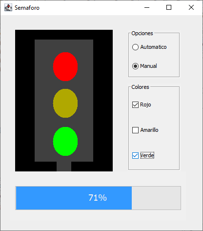

# Semaforo
Simulación de un semáforo

### Instrucciones

El semáforo tiene dos tipos de funcionamiento, automático y manual.

El funcionamiento automático, se usa para operaciones normales, existen 3 botones:
1. Play (Hace funcionar el semaforo)
2. Stop (Para el semáforo)
3. Tiempo (Determina la rapidez en el que cambia de bombillo)

El funcionamiento manual, se usa para pruebas, existen 3 checkbox. 

Cada checkbox representa un bombillo, y la posibilidad de prenderlo o hacerlo titilar. 

