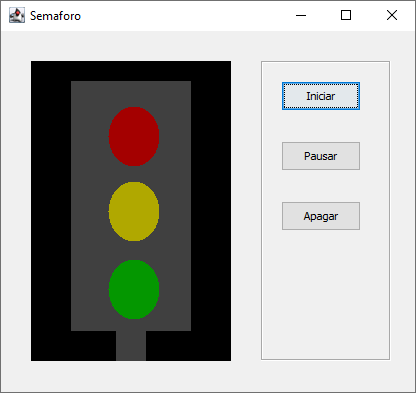

# Semaforo
Simulación de un semáforo

Se utiliza el patrón de comportamiento estado para determinar los estados del semáforo, además se incluye con una interfaz gráfica fácil de usar.

En la siguiente imagen se pueden ver los diferentes elementos que se muestran en la interfaz gráfica.

